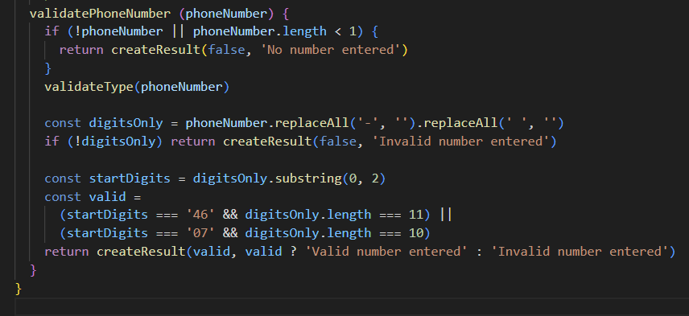

# Reflections 

| Name               | Explanation               | Reflection & rules from Clean Code   | 
|-----------------------|--------------------------|---------------------------------------|
| PasswordValidator     | Class which validates a string |  **Class Names:** should not be a noun. Either I should drop Validator or change it to PasswordPolicy.  |
| validatePhoneNumber   | Method which checks if it's a swedish phonenumber | **Use Searchable names:** My wrapper class has the same method name as the subclass method. This will make it confusing when searching for the method. I could just as easily flip the name in the subclass. So it's phoneNumberValidator **Avoid Disinformation:** The method only works for swedish cellular numbers which it doesn't mention anywhere.|
| validDate             | Method which returns true or false depending if it's a valid date   | **Method name:** Should've been isValidDate to indicate that a bool is returned. Removes some confusion    |
| luhnAlgorithm         | Method which calculates the last digit in a personalnumber   | **Avoid Disinformation:** The name only suggest that the luhn algorithm is used but doesn't give any valuable information. |
| Value                 | Many methods had arguements named value      | **Add Meaningful Context:** The name value only says it's a value. Not what the value represents which makes it unclear.  |

--- 
### Chapter 2 reflections

After reading this chapter and looking at my code I found some problems. My variables & arguments often don't give any information. I usually name them **value** and then I have to go back and use a console.log to see what is being sent. With better naming system I would save myself time by having more descriptive names. It will be even worse for other people trying to read my code. 

I have also noticed that I use **Cute** variable names which is only meant to be for testing. But sometimes I forget about them and find them laying around in my code much later. Since I don't have a good naming system I don't know if it's a temporary variable name or not. So have to read the entire block to find out which I also spend way to much time doing.

---

| Methodname               | Link or code               | Amount of rows   | Reflection
|-----------------------|--------------------------|---------------------------------------|--|
| validatePhoneNumber   |  |  10  | Test 1
| luhnAlgorithm         |                                   |  9  | Test 2
| validatePassword      |                                   |  22  | Test 3
| validateInput         |                                   |  16  | Test 4 
| validDate             |                                   |  8  | Test 5

Läs kapitel 3. Skapa en tabell över dina fem längsta metoder/funktioner. Utgå ifrån kapitel 3s titlar och ange de viktigaste reglerna (som följs/bryts). Föreslå förändringar.

| validateDay, month & year |  |  11  | Here I disagree with the book and think this should have been 1 method instead of three. 3 different methods that are so similar 

Skriv även en kort reflektion kring innehållet i kapitel 3. Ni kanske upptäcker en brist hos er tidigare skrivning av funktionerna, ni kanske inte håller med någon av “reglerna” från kursboken. Jag ser hellre att ni hittar och reflekterar över era brister än att ni döljer dem.

Har använt mig utav LNU eslint som kräver JSDOC. Gillar formatet men mycket av texten är helt onödig då jag tycker metodnamnen beskriver vad som sker. Kommer se över om det finns några liknande eller om det går att ändra configen för att få som jag vill ha det.

validatePhoneNumber Gör för mycket borde delas upp i mindre

