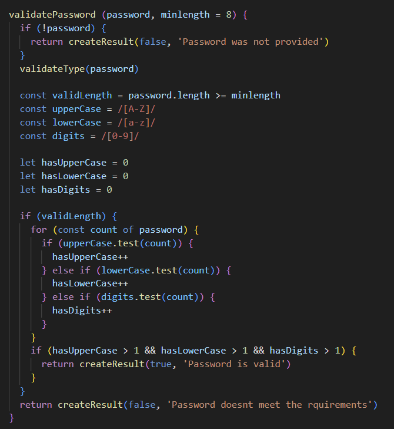

## Test Rapport

My module has been tested using Jest for all public methods, except DOM-specific methods which were tested manually in a browser. Automated tests cover input validation with both correct, incorrect values and no values. Manual tests verify interactive HTML form elements behave as expected.

If you want to run these tests yourself, open this project and type "npm run test" in the terminal.

In these table you'll see the public methods in the classes that are used and what the outcome will be with the example data.

| Classes               | MethodName               | How (example)                         | Result |
|-----------------------|--------------------------|---------------------------------------|--------|
| emailValidator        | validateEmail            | validateEmail("test@test")            | False  |
| formValidator         | isNotEmpty               | isNotEmpty("test")                    | True   |
| passwordValidator     | validatePassword         | validatePassword(Kalle)               | False  |
| personNumberValidator | validatePersonalNumber   | validatePersonalNumber("1212121212")  | True   |
| phoneNrValidator      | validatePhoneNumber      | validatePhoneNumber("070 123 12 34")  | True   |

---
In the class called **DOMFormValidator** you have 2 methods that have been tested manually. These take data from htmlElement which is the reason they are tested manually instead of with Jest.

**checkBoxChecker** - Checks to see if any of the provided checkboxes are ticked.  
**radioButton** Checks to see if any of the provided radiobuttons are pressed.

If you want to run these tests yourself, open src/tests/index.html in a webbrowser. Click on the checkboxes and radiobuttons so you can see what happens. In validationsReult.js you'll see how it's implemented.

